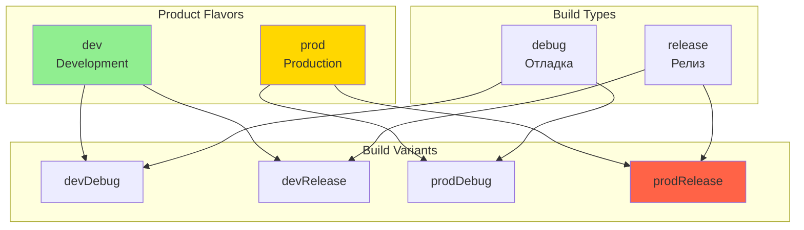
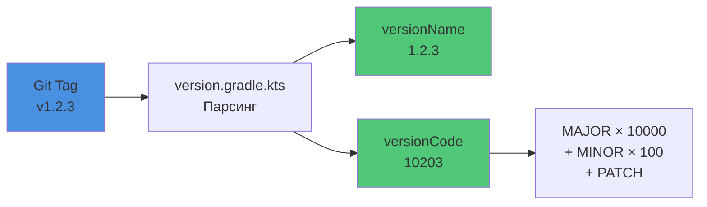
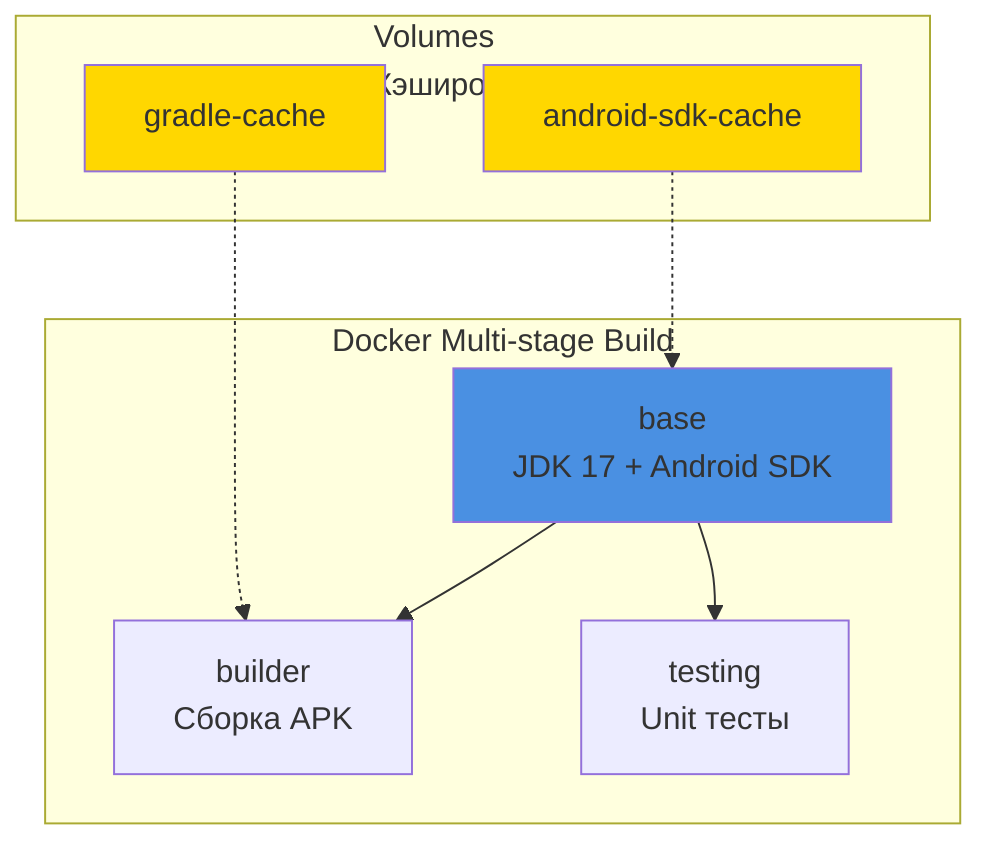
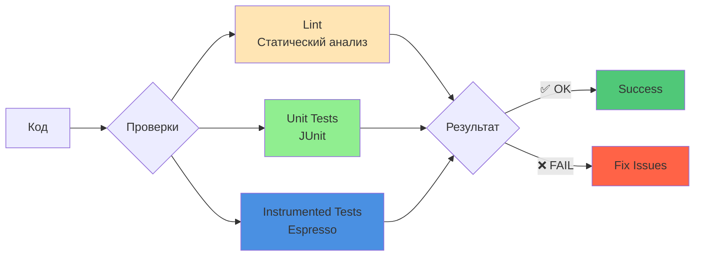
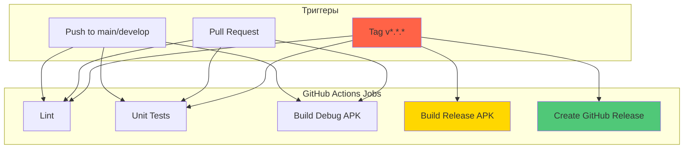
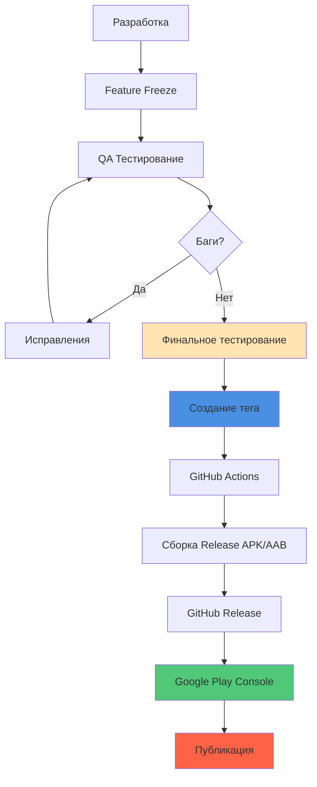

# 🏗️ Russify — Полная документация по сборке

Система сборки Android приложения уровня production с автоматизацией, версионированием и CI/CD.

---

## 📋 Содержание

- [Требования](#-требования)
- [Build Flavors](#-build-flavors)
- [Версионирование](#-версионирование)
- [Сборка](#-сборка)
- [Docker](#-docker)
- [Тестирование](#-тестирование)
- [CI/CD](#-cicd)
- [Deployment](#-deployment--production-релиз)
- [Troubleshooting](#-troubleshooting)

---

## 📦 Требования

### Локальная разработка


| Компонент       | Версия   | Обязательно                    |
| --------------- | -------- | ------------------------------ |
| **Java JDK**    | 17 (LTS) | ✅ Да                           |
| **Android SDK** | API 35   | ✅ Да                           |
| **Gradle**      | 8.x      | ✅ Да (в wrapper)               |
| **Git**         | Любая    | ✅ Да                           |
| **ADB**         | Любая    | ⚠️ Для установки на устройства |
| **Make**        | Любая    | ⚠️ Для упрощенных команд       |
| **Docker**      | 20.10+   | ⚠️ Для изолированной сборки    |


---

## 🎯 Build Flavors

Проект использует **Product Flavors** для разделения окружений:




### 📱 Development (dev)

**Назначение:** Разработка с локальным backend сервером

- **Backend URL:** `http://192.168.0.49:8080` (Wi-Fi локальная сеть)
- **Application ID:** `com.example.Russify.dev`
- **Название:** "Russify Dev"
- **Логирование:** ✅ Включено
- **Минификация:** ❌ Выключена (debug), ✅ Включена (release)

**Команды:**

```bash
make dev-debug            # Debug сборка для разработки
make dev-release          # Release сборка для тестирования
make dev-run              # Собрать, установить и запустить
```

### 🌍 Production (prod)

**Назначение:** Production релизы для пользователей

- **Backend URL:** `https://api.russify.com` (production API)
- **Application ID:** `com.example.Russify`
- **Название:** "Russify"
- **Логирование:** ❌ Выключено
- **Минификация:** ✅ ProGuard/R8

**Команды:**

```bash
make prod-debug           # Debug для отладки prod проблем
make prod-release         # Production APK для релиза
```

### 🔧 Настройка Backend URL

**Development:** Автоматически использует IP компьютера в локальной сети.

**Production:** Измените в `app/build.gradle.kts`:

```kotlin
create("prod") {
    buildConfigField("String", "BASE_URL", "\"https://your-production-api.com\"")
}
```

**В коде:**

```kotlin
val baseUrl = BuildConfig.BASE_URL        // Автоматически подставляется
val environment = BuildConfig.ENVIRONMENT  // "development" или "production"
```

---

## 📌 Версионирование

Автоматическое версионирование на основе **Git tags** (Semantic Versioning).




### Как работает

- **versionName**: берется из git tag (`v1.2.3` → `1.2.3`)
- **versionCode**: рассчитывается автоматически

**Формула versionCode:**

```kotlin
versionCode = MAJOR * 10000 + MINOR * 100 + PATCH
```

**Примеры:**


| Git Tag   | versionName | versionCode | Описание        |
| --------- | ----------- | ----------- | --------------- |
| `v1.0.0`  | 1.0.0       | 10000       | Первый релиз    |
| `v1.2.3`  | 1.2.3       | 10203       | Обновление      |
| `v2.5.10` | 2.5.10      | 20510       | Мажорная версия |


### Создание версии

```bash
# Через Makefile (рекомендуется)
make release-tag VERSION=1.2.3

# Или вручную
git tag -a v1.2.3 -m "Release version 1.2.3"
git push origin v1.2.3
```

### Проверка версии

```bash
make version              # Показать текущую версию
```

### Semantic Versioning правила

- **MAJOR** (X.0.0): Несовместимые изменения API
- **MINOR** (0.X.0): Новая функциональность (обратно совместимая)
- **PATCH** (0.0.X): Исправления багов

---

## 🛠️ Сборка

### Makefile команды (рекомендуется)

```bash
# Показать все команды
make help

# Development
make dev-debug            # Собрать dev debug APK
make dev-release          # Собрать dev release APK
make dev-install          # Собрать и установить
make dev-run              # Собрать, установить, запустить

# Production
make prod-debug           # Собрать prod debug
make prod-release         # Собрать prod release APK

# Тестирование
make test                 # Unit тесты
make lint                 # Lint проверки
make check                # Все проверки (lint + tests)

# Утилиты
make clean                # Очистить build
make devices              # Список устройств
make logs-dev             # Логи dev приложения
```

### Gradle команды напрямую

**macOS/Linux:**

```bash
./gradlew assembleDevDebug        # Собрать dev debug
./gradlew assembleProdRelease     # Собрать prod release
./gradlew installDevDebug         # Установить на устройство
./gradlew bundleProdRelease       # Создать AAB для Play Store
```

**Windows:**

```powershell
.\gradlew.bat assembleDevDebug
.\gradlew.bat assembleProdRelease
```

### Пути к собранным APK

```
app/build/outputs/apk/
├── dev/
│   ├── debug/    → app-dev-debug.apk
│   └── release/  → app-dev-release.apk
└── prod/
    ├── debug/    → app-prod-debug.apk
    └── release/  → app-prod-release.apk
```

### AAB для Google Play

```bash
./gradlew bundleProdRelease
# Файл: app/build/outputs/bundle/prodRelease/app-prod-release.aab
```

---

## 🐳 Docker

Docker сборка обеспечивает **reproducible builds** в изолированной среде.




### Docker Compose (рекомендуется)

```bash
# Development builds
docker compose up --build build-dev-debug
docker compose up --build build-dev-release

# Production builds
docker compose up --build build-prod-release

# Тестирование
docker compose up --build test-dev
docker compose up --build lint-dev

# Интерактивный shell
docker compose run --rm shell
```

### Makefile команды

```bash
make docker-dev-debug        # Docker сборка dev-debug
make docker-prod-release     # Docker сборка prod-release
make docker-test             # Тесты в Docker
make docker-shell            # Shell в контейнере
```

### Прямое использование Docker

```bash
# Собрать образ
docker build -t russify-android .

# Собрать APK
docker run --rm -v "$(pwd):/workspace" russify-android \
    ./gradlew assembleDevDebug
```

**Преимущества Docker:**

- ✅ Reproducible builds (одинаковая среда для всех)
- ✅ Не нужно устанавливать Android SDK локально
- ✅ Изоляция окружения
- ✅ Кэширование зависимостей

---

## 🧪 Тестирование




### Unit тесты

```bash
# Makefile
make test                 # Все тесты
make test-dev             # Тесты для dev
make test-prod            # Тесты для prod

# Gradle
./gradlew test
./gradlew testDevDebugUnitTest
./gradlew testProdDebugUnitTest
```

### Lint проверки

```bash
# Makefile
make lint                 # Все lint проверки
make lint-dev             # Lint для dev
make lint-prod            # Lint для prod

# Gradle
./gradlew lint
./gradlew lintDevDebug
```

### Все проверки

```bash
make check                # Lint + Tests
# или
./gradlew check
```

### Instrumented тесты (на устройстве)

```bash
# Подключите устройство или запустите эмулятор
./gradlew connectedDevDebugAndroidTest
```

### Отчеты

После тестов отчеты доступны в:

- **Unit tests:** `app/build/reports/tests/`
- **Lint:** `app/build/reports/lint/`
- **Instrumented:** `app/build/reports/androidTests/`

### Просмотр логов

```bash
make logs-dev             # Логи dev приложения
make logs-crash           # Только ошибки

# Напрямую через logcat
adb logcat | grep -i russify
```

---

## 🔄 CI/CD

GitHub Actions автоматизирует сборку, тестирование и релизы.




### Workflow файл

`.github/workflows/android-ci.yml` настроен для:

**На каждый Push/PR:**

1. ✅ Lint проверки
2. ✅ Unit тесты
3. ✅ Сборка debug APK

**При создании тега (`v*.*.`*):**

1. ✅ Все вышеперечисленное
2. ✅ Сборка release APK/AAB
3. ✅ Создание GitHub Release
4. ✅ Прикрепление APK файлов

### Создание релиза через CI

```bash
# 1. Создайте тег
make release-tag VERSION=1.0.0

# 2. Push на GitHub
git push origin v1.0.0

# 3. GitHub Actions автоматически:
#    - Запустит все тесты
#    - Соберет release APK/AAB
#    - Создаст GitHub Release
#    - Прикрепит артефакты
```

### Локальный CI pipeline

Протестируйте CI локально перед push:

```bash
make ci-test              # Тесты как в CI
make ci-build             # Сборка как в CI
make ci-all               # Полный CI pipeline
```

---

## 🚀 Deployment — Production релиз

### Процесс релиза




### 1. Pre-Release Checklist

Перед созданием релиза убедитесь:

- Все тесты проходят: `make check`
- Lint проверки пройдены: `make lint`
- Приложение протестировано на реальных устройствах
- Backend URL настроен на production
- Все критические баги исправлены
- Code review пройден

### 2. Настройка Signing

**Создайте keystore (один раз):**

```bash
keytool -genkey -v -keystore release.keystore \
        -alias russify \
        -keyalg RSA \
        -keysize 2048 \
        -validity 10000

# Сохраните пароли в надежном месте!
```

**Создайте `signing.properties`** (НЕ коммитить!):

```properties
RELEASE_STORE_FILE=release.keystore
RELEASE_STORE_PASSWORD=ваш_store_password
RELEASE_KEY_ALIAS=russify
RELEASE_KEY_PASSWORD=ваш_key_password
```

**Обновите `app/build.gradle.kts`:**

```kotlin
// Загрузить signing config
val signingPropertiesFile = rootProject.file("signing.properties")
val signingProperties = Properties()
if (signingPropertiesFile.exists()) {
    signingProperties.load(FileInputStream(signingPropertiesFile))
}

android {
    signingConfigs {
        create("release") {
            storeFile = file(signingProperties.getProperty("RELEASE_STORE_FILE"))
            storePassword = signingProperties.getProperty("RELEASE_STORE_PASSWORD")
            keyAlias = signingProperties.getProperty("RELEASE_KEY_ALIAS")
            keyPassword = signingProperties.getProperty("RELEASE_KEY_PASSWORD")
        }
    }

    buildTypes {
        release {
            signingConfig = signingConfigs.getByName("release")
        }
    }
}
```

### 3. Создание релиза

**Автоматический (рекомендуется):**

```bash
# 1. Создать тег
make release-tag VERSION=1.0.0

# 2. Push на GitHub
git push origin v1.0.0

# 3. GitHub Actions автоматически создаст релиз
```

**Ручной:**

```bash
# 1. Создать тег
git tag -a v1.0.0 -m "Release version 1.0.0"

# 2. Собрать production release
make prod-release

# APK: app/build/outputs/apk/prod/release/app-prod-release.apk

# 3. Создать AAB для Google Play
./gradlew bundleProdRelease

# AAB: app/build/outputs/bundle/prodRelease/app-prod-release.aab
```

### 4. Публикация в Google Play Store

**Подготовка:**

```bash
# Собрать signed AAB
./gradlew bundleProdRelease
```

**Шаги публикации:**

1. **Google Play Console** → [https://play.google.com/console](https://play.google.com/console)
2. **Создайте приложение** (если первый раз):
  - Название, язык, категория
3. **Загрузите AAB**:
  - Production → Create new release
  - Upload `app-prod-release.aab`
4. **Store Listing**:
  - Описание, скриншоты, иконка
5. **Content Rating**:
  - Заполните анкету
6. **Ценообразование**:
  - Бесплатно/платно, страны
7. **Submit for Review**

### 5. Тестирование Production Build

**Локально:**

```bash
# Собрать prod debug для тестирования
make prod-debug
make install-prod-debug

# Проверьте:
# ✓ Подключение к production backend
# ✓ Все функции работают
# ✓ Нет debug логов
# ✓ ProGuard работает корректно
```

**Internal Testing в Google Play:**

1. Загрузите AAB в "Internal testing" track
2. Добавьте тестировщиков через email
3. Соберите feedback перед публикацией

### 6. Версионирование релизов

**Semantic Versioning:**

- **MAJOR**: Несовместимые изменения API
- **MINOR**: Новая функциональность
- **PATCH**: Исправления багов

**Примеры:**

```bash
# Первый релиз
make release-tag VERSION=1.0.0

# Исправление бага
make release-tag VERSION=1.0.1

# Новая функция
make release-tag VERSION=1.1.0

# Breaking changes
make release-tag VERSION=2.0.0
```

### 7. Post-Release

**Мониторинг:**

1. **Google Play Console:**
  - Crash reports
  - ANR (Application Not Responding)
  - User reviews
2. **Analytics** (если подключены):
  - Firebase Analytics
  - Performance metrics

**Hotfix процесс:**

```bash
# 1. Создайте hotfix branch
git checkout -b hotfix/1.0.1 v1.0.0

# 2. Исправьте баг
# ... code changes ...

# 3. Создайте patch version
make release-tag VERSION=1.0.1

# 4. Build и deploy
make prod-release

# 5. Merge обратно в main
git checkout main
git merge hotfix/1.0.1
```

### 🔒 Безопасность

**⚠️ НИКОГДА не коммитьте:**

- ❌ `*.keystore` файлы
- ❌ `signing.properties`
- ❌ API ключи и секреты

**Добавьте в `.gitignore`:**

```gitignore
*.keystore
*.jks
signing.properties
google-services.json
secrets.properties
```

**Для CI/CD:**

Используйте GitHub Secrets:

```yaml
# .github/workflows/android-ci.yml
- name: Setup signing
  run: |
    echo "${{ secrets.SIGNING_PROPERTIES }}" > signing.properties
    echo "${{ secrets.RELEASE_KEYSTORE }}" | base64 -d > release.keystore
```

---

## 🔧 Troubleshooting

### "Permission denied" при запуске gradlew

**Причина:** Файл gradlew не имеет прав на выполнение.

**Решение:**

```bash
chmod +x gradlew
./scripts/fix-permissions.sh
```

### Gradle не может скачать зависимости

**Решение:**

```bash
make clean
./gradlew --refresh-dependencies
```

### "SDK location not found"

**Решение:**

Создайте `local.properties`:

```properties
sdk.dir=/path/to/android-sdk
```

Или установите переменную:

```bash
export ANDROID_HOME=/path/to/android-sdk
```

### Docker сборка медленная

**Причина:** Первая сборка скачивает SDK и зависимости.

**Решение:**

- Volumes используются для кэширования
- Последующие сборки будут быстрее
- Для полной пересборки:
  ```bash
  docker compose down -v
  docker compose build --no-cache
  ```

### ADB не видит устройство

**Решение:**

```bash
# Перезапустите ADB
adb kill-server
adb start-server
adb devices
```

Если не помогло:

- Проверьте USB кабель
- Разрешите USB отладку на телефоне
- Попробуйте другой USB порт
- Установите драйверы устройства (Windows)

### Телефон не может подключиться к backend

**Решение:**

1. Убедитесь что телефон и компьютер в **одной Wi-Fi сети**
2. Проверьте IP адрес:
  ```bash
   # macOS/Linux
   ifconfig | grep "inet "

   # Windows
   ipconfig
  ```
3. Обновите IP в `app/build.gradle.kts`:
  ```kotlin
   create("dev") {
       buildConfigField("String", "BASE_URL", "\"http://НОВЫЙ_IP:8080\"")
   }
  ```
4. Проверьте firewall (должен разрешать порт 8080)

### "compileSdk version" ошибка

**Решение:**

Установите Android SDK API level 35:

```bash
# Через Android Studio SDK Manager
# Или command line:
sdkmanager "platforms;android-35"
```

### Out of memory при сборке

**Решение:**

Увеличьте heap в `gradle.properties`:

```properties
org.gradle.jvmargs=-Xmx4096m -XX:MaxMetaspaceSize=512m
```

### ProGuard ломает код после release сборки

**Решение:**

Добавьте правила в `proguard-rules.pro`:

```proguard
# Keep model classes
-keep class com.example.Russify.model.** { *; }

# Keep Ktor
-keep class io.ktor.** { *; }

# Keep Kotlin serialization
-keepattributes *Annotation*, InnerClasses
-dontnote kotlinx.serialization.**
```

### Тесты падают в CI, но работают локально

**Причина:** Разные версии зависимостей или окружение.

**Решение:**

1. Запустите локальный CI pipeline:
  ```bash
   make ci-test
  ```
2. Используйте Docker для reproducible builds:
  ```bash
   make docker-test
  ```
3. Проверьте версии в `build.gradle.kts`

---

## 📚 Дополнительные ресурсы

### Официальная документация

- [Android Gradle Plugin](https://developer.android.com/build)
- [Gradle Build Tool](https://gradle.org/)
- [Docker Documentation](https://docs.docker.com/)
- [ADB Documentation](https://developer.android.com/tools/adb)
- [Semantic Versioning](https://semver.org/)
- [ProGuard](https://www.guardsquare.com/manual/configuration/usage)

### Полезные команды

```bash
# Информация
make help                 # Все доступные команды
make version              # Текущая версия
make devices              # Список устройств

# Управление зависимостями
./gradlew dependencies    # Dependency tree
./gradlew dependencyUpdates # Проверить обновления

# Build варианты
./gradlew tasks           # Все доступные tasks
./gradlew projects        # Структура проекта
```

