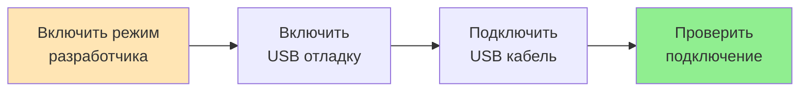
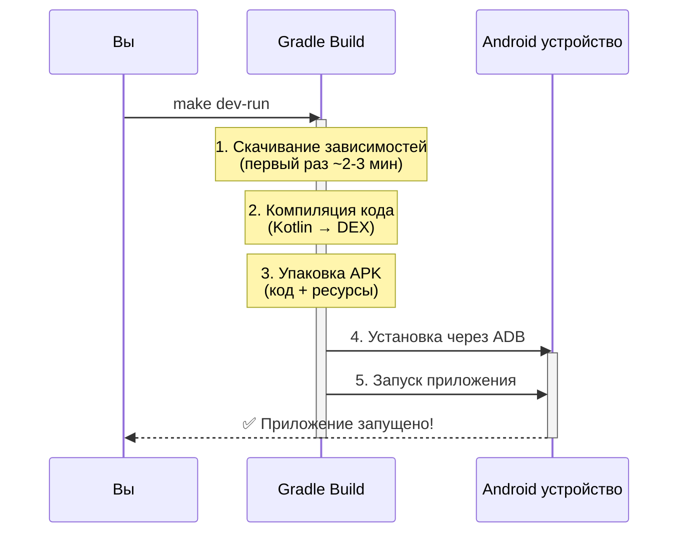
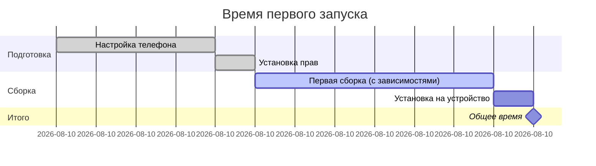

# ⚡ Быстрый старт — 5 минут до первого запуска

Этот гайд поможет собрать и запустить приложение на телефоне за 5 минут.

---

## 📋 Перед началом

### 1. Запустите Backend

```bash
cd ../Russify
# Запустите backend (см. документацию backend)
# Backend должен быть доступен на http://192.168.0.49:8080
```

### 2. Подготовьте Android устройство




**Шаги:**

1. **Включите режим разработчика**
  - Настройки → О телефоне
  - 7 раз нажмите на "Номер сборки"
2. **Включите USB отладку**
  - Настройки → Для разработчиков
  - Включите "USB отладка"
3. **Подключите телефон по USB**
  - Разрешите USB отладку на телефоне (диалог)
4. **Проверьте подключение**
  ```bash
   cd MobileProgram
   ./scripts/check-device.sh
   # Ожидается: ✅ Device is ready for development!
  ```

---

## 🚀 Установка и запуск

### ⚠️ Первый раз? Установите права

Если проект только что склонирован:

```bash
cd MobileProgram

# Вариант A: через скрипт
./scripts/fix-permissions.sh

# Вариант B: вручную
chmod +x gradlew scripts/*.sh
```

### Вариант 1: Make (рекомендуется) ⭐

```bash
cd MobileProgram

# Одна команда: сборка + установка + запуск
make dev-run
```

### Вариант 2: Скрипт

**macOS/Linux:**

```bash
./scripts/install-dev.sh
```

**Windows PowerShell:**

```powershell
.\scripts\install-dev.ps1
```

### Вариант 3: Gradle напрямую

**macOS/Linux:**

```bash
./gradlew installDevDebug
```

**Windows:**

```powershell
.\gradlew.bat installDevDebug
```

---

## 📊 Что происходит при сборке




**Время выполнения:**

- Первая сборка: 2-3 минуты (скачивание зависимостей)
- Последующие: 30-60 секунд (благодаря кэшу)

---

## 🔍 Проверка работы

### Просмотр логов

```bash
# Логи в реальном времени
make logs-dev

# Или через ADB
adb logcat | grep -i russify
```

### Пересборка после изменений

```bash
# Просто запустите снова
make dev-run
```

### Удаление приложения

```bash
make uninstall-dev
```

---

## 🐛 Troubleshooting

### ❌ Телефон не видит backend

**Проблема:** Приложение не может подключиться к backend.

**Решение:**

1. Убедитесь, что телефон и компьютер в **одной Wi-Fi сети**
2. Проверьте IP адрес компьютера:
  ```bash
   # macOS/Linux
   ifconfig | grep "inet "

   # Windows
   ipconfig
  ```
3. Если IP изменился, обновите в `app/build.gradle.kts`:
  ```kotlin
   create("dev") {
       buildConfigField("String", "BASE_URL", "\"http://ВАШ_IP:8080\"")
   }
  ```
4. Убедитесь что backend запущен:
  ```bash
   curl http://192.168.0.49:8080/health
  ```

### ❌ ADB не видит устройство

**Решение:**

```bash
# Перезапустите ADB
adb kill-server
adb start-server
adb devices
```

Если не помогло:

- Проверьте USB кабель
- Разрешите USB отладку на телефоне
- Попробуйте другой USB порт

### ❌ "Permission denied" при запуске gradlew

**Решение:**

```bash
chmod +x gradlew
./scripts/fix-permissions.sh
```

### ❌ Gradle ошибки при сборке

**Решение:**

```bash
# Очистите и пересоберите
make clean
./gradlew --refresh-dependencies
make dev-debug
```

### ❌ "No devices connected"

**Решение:**

```bash
# Проверьте подключение
adb devices

# Должно показать:
# List of devices attached
# XXXXXX    device
```

Если пусто:

1. Проверьте что USB отладка включена
2. Разрешите отладку на телефоне (диалог)
3. Попробуйте другой USB кабель

---

## 📱 Полезные команды

```bash
# Информация
make help                 # Показать все команды
make devices              # Список подключенных устройств
make version              # Текущая версия приложения

# Разработка
make dev-run              # Собрать, установить, запустить
make dev-debug            # Только собрать debug APK
make logs-dev             # Логи приложения

# Очистка
make clean                # Очистить build
make uninstall-dev        # Удалить приложение с устройства
```

---

## 🎯 Что дальше?

### ✅ Всё работает

Отлично! Теперь вы можете:

1. **Разрабатывать**: Меняйте код → `make dev-run` → тестируйте
2. **Смотреть логи**: `make logs-dev` для отладки
3. **Изучить документацию**: [BUILD.md](BUILD.md) для продвинутых возможностей

### 📖 Дополнительное изучение


| Тема             | Документ             | Раздел           |
| ---------------- | -------------------- | ---------------- |
| Все команды Make | [BUILD.md](BUILD.md) | Makefile команды |
| Docker сборка    | [BUILD.md](BUILD.md) | Docker           |
| Тестирование     | [BUILD.md](BUILD.md) | Тестирование     |
| Production релиз | [BUILD.md](BUILD.md) | Deployment       |
| CI/CD настройка  | [BUILD.md](BUILD.md) | CI/CD            |


---

## 🏁 Checklist первого запуска

Используйте этот checklist для проверки:

- Backend запущен и доступен
- Режим разработчика включен на телефоне
- USB отладка включена
- Телефон подключен по USB
- `adb devices` показывает устройство
- Права на gradlew установлены (`chmod +x`)
- Телефон и компьютер в одной Wi-Fi сети
- `make dev-run` выполнен успешно
- Приложение запустилось на телефоне
- Backend доступен с телефона

---

## ⏱️ Timeline




**Итого:** ~6 минут при первом запуске на MacBook Pro 16 M1 Pro, затем 1-2 минуты.

---

**✨ Готово! Приятной разработки!**

💡 **Совет:** Добавьте `make dev-run` в избранные команды терминала для быстрого доступа.