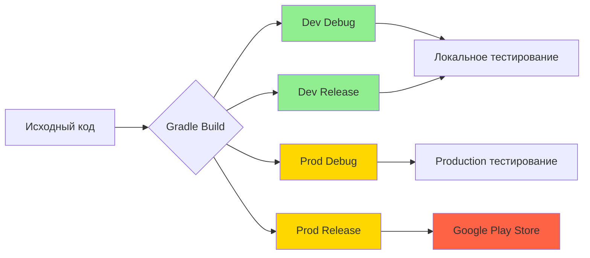
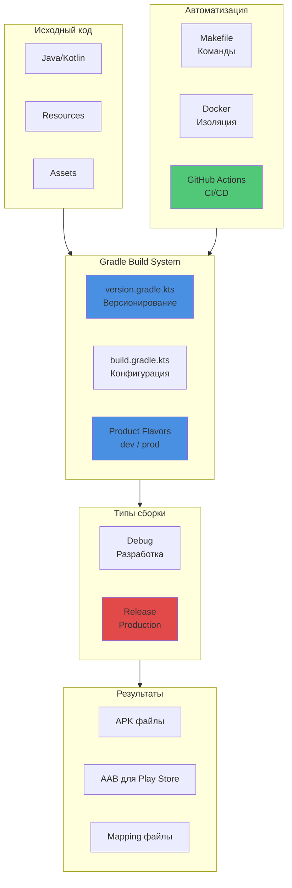
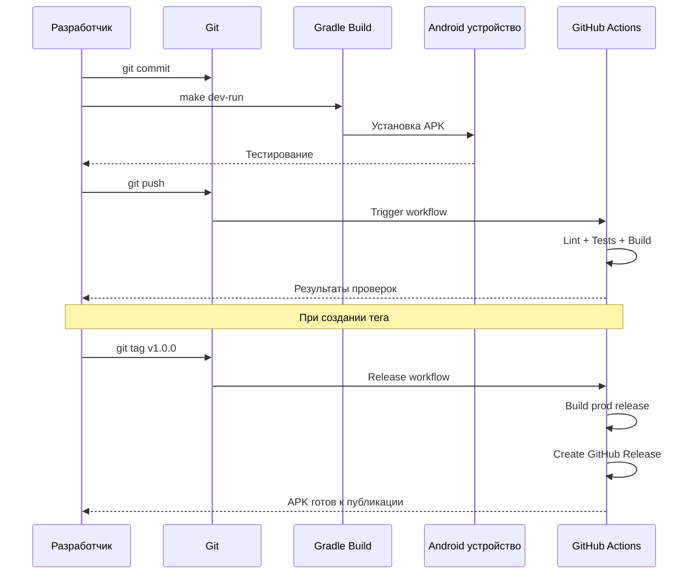

# 📱 Russify - Документация

Android приложение с современной системой сборки и автоматизацией уровня production.

---

## 🚀 Быстрый старт

**Новичок?** Начните с [QUICKSTART.md](QUICKSTART.md) — за 5 минут соберете и запустите приложение на телефоне.

**Опытный разработчик?** См. [BUILD.md](BUILD.md) для полной документации по сборке, тестированию и релизу.

---

## 📚 Структура документации

| Документ | Описание | Для кого |
|----------|----------|----------|
| **[QUICKSTART.md](QUICKSTART.md)** | Быстрый старт за 5 минут | Новички, быстрая настройка |
| **[BUILD.md](BUILD.md)** | Полная документация | Разработчики, CI/CD, релизы |

---

## 🎯 Возможности системы сборки



### ✅ Реализовано

- **Multi-flavor builds** — dev и prod окружения
- **Автоматическое версионирование** — из Git tags (semver)
- **Docker сборка** — reproducible builds
- **CI/CD** — GitHub Actions с автоматическими релизами
- **Makefile автоматизация** — 60+ команд для упрощения работы
- **ProGuard/R8** — оптимизация и обфускация кода
- **Signing configs** — безопасная подпись релизов

---

## ⚡ Самые используемые команды

```bash
# Разработка
make dev-run              # Собрать, установить и запустить dev версию
make logs-dev             # Посмотреть логи приложения

# Production
make prod-release         # Собрать production APK
make release-tag VERSION=1.0.0  # Создать релиз тег

# Тестирование
make test                 # Запустить тесты
make lint                 # Проверка кода
make check                # Все проверки

# Утилиты
make help                 # Показать все команды
make clean                # Очистить build
```

---

## 🏗️ Архитектура Build System



---

## 🔧 Требования

### Минимальные

- **Java 17** (LTS)
- **Android SDK** API 35
- **Gradle 8.x** (включен в wrapper)
- **Git** для версионирования

### Опциональные

- **Make** — для упрощенных команд
- **Docker** — для изолированной сборки
- **ADB** — для установки на устройства

---

## 📦 Build Flavors

| Flavor | Backend | App ID | Название | Использование |
|--------|---------|--------|----------|---------------|
| **dev** | `http://192.168.0.49:8080` | `com.example.Russify.dev` | Russify Dev | Разработка с локальным backend |
| **prod** | `https://api.russify.com` | `com.example.Russify` | Russify | Production релизы |

---

## 🔄 Workflow разработки



---

## 🚀 Релизы

### Процесс создания релиза

```bash
# 1. Создать тег версии
make release-tag VERSION=1.0.0

# 2. Push на GitHub
git push origin v1.0.0

# 3. GitHub Actions автоматически:
#    ✓ Соберет release APK/AAB
#    ✓ Запустит все тесты
#    ✓ Создаст GitHub Release
#    ✓ Прикрепит артефакты
```

Подробнее в разделе "Deployment" в [BUILD.md](BUILD.md).

---

## 📖 Дополнительные ресурсы

### Официальная документация

- [Android Gradle Plugin](https://developer.android.com/build)
- [Gradle Build Tool](https://gradle.org/)
- [Docker Documentation](https://docs.docker.com/)

### Внутренние ссылки

- [Troubleshooting](BUILD.md#-troubleshooting) — решение типичных проблем
- [CI/CD Setup](BUILD.md#-cicd) — настройка автоматизации
- [Versioning](BUILD.md#-версионирование) — система версий
